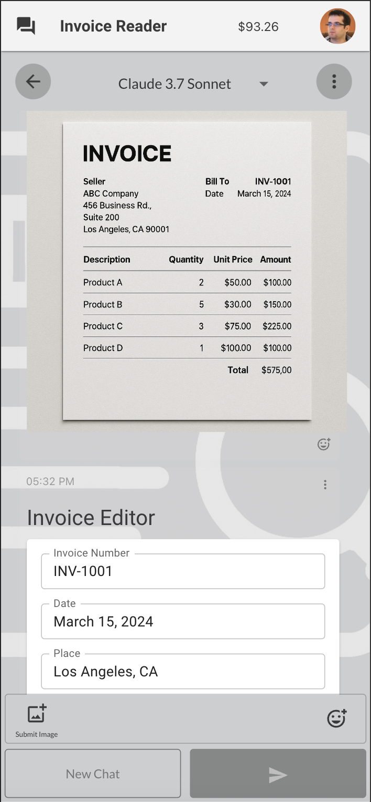
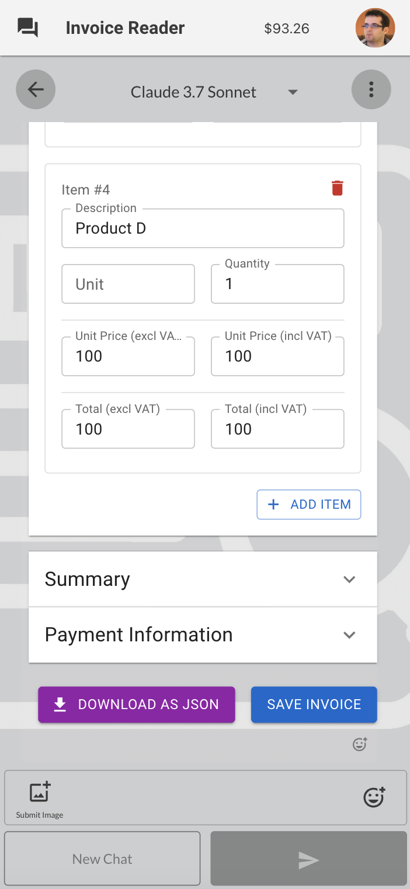

# AI Invoice Extraction Tool &middot; [](https://github.com/open-kbs/{{{openkbs.repo}}}/blob/main/LICENSE)
<table>
  <tr>
    <td>
      
    </td>
    <td>
      <strong>AI based invoice extraction tool</strong>
    </td>
  </tr>
</table>

<br />

<div style="display: flex; flex-direction: row;">
    
    
</div>

## Installation Guide

### Step 1: Install OpenKBS CLI and Login

You need to have the OpenKBS CLI installed on your system and Login:

```bash
npm install -g openkbs
openkbs login
```

### Step 2: Clone the Repository

Clone the repository to your local machine:

```bash
git clone git@github.com:open-kbs/ai-invoice.git
cd ai-invoice
```

### Step 3: Deploy the Application to the OpenKBS Cloud:
Deploy your application using the OpenKBS CLI:

```bash
openkbs push
```

Once the deployment is complete, you will receive a URL for your app: `https://{kbId}.apps.openkbs.com`.
Login to your KB and have fun!

### Step 4: Running the Frontend Locally for development

Run the OpenKBS UI dev server locally:

```bash
npm i
npm start
```

## Install via WEB
To install this app via our website visit [AI Invoice](https://openkbs.com/apps/ai-invoice/)


## License

This project is licensed under the MIT License. For more details, please refer to the [LICENSE](https://github.com/open-kbs/ai-invoice/blob/main/LICENSE) file.
